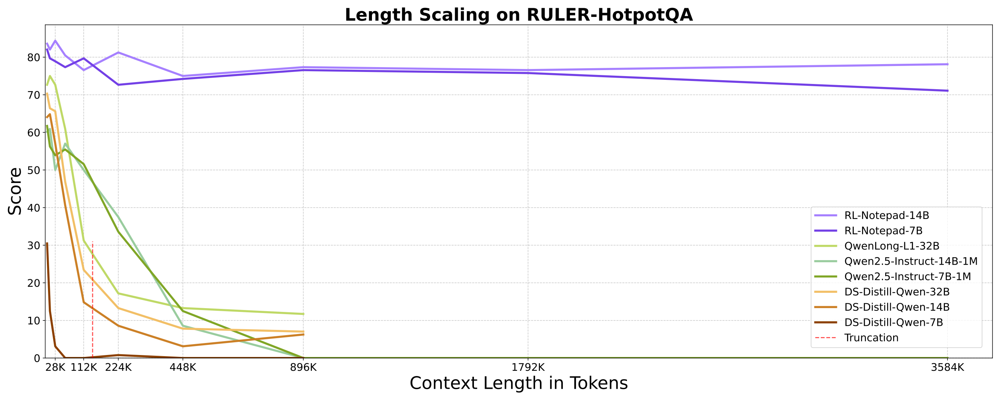
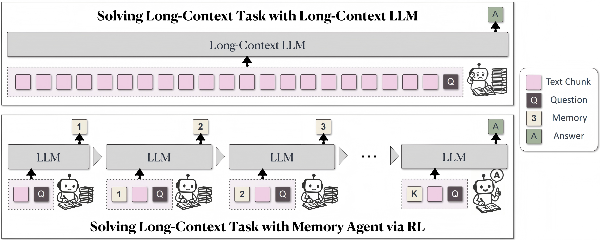

<div align='center'> 
<h1>RL-Notepad: Refreshing Long-Context for LLMs: The Memory Agent Paradigm via Reinforcement Learning</h1>

<!-- TODO: Add actual links when available -->
[](https://arxiv.org/abs/xxxx.xxxxx)
[](https://rl-notepad.github.io/)
[](https://huggingface.co/datasets/RL-Notepad/RULER-QA)
[](https://huggingface.co/RL-Notepad/RL-Notepad-14B)
</div>

> [!IMPORTANT]
> **🔥 News!!!**
> - [2025/06] We release RL-Notepad-14B and RL-Notepad-7B models achieving near-lossless performance on 3.5M token sequences with <5% degradation.

We introduce **RL-Notepad**, a revolutionary framework that solves the "impossible triangle" of long-context language models: unlimited length support, linear computational complexity, and strong extrapolation capabilities. Our approach enables effective extrapolation from 32K training windows to 3.5M tokens while maintaining near-lossless performance.

## Key Innovation

RL-Notepad breaks through traditional limitations by introducing a **dynamic notepad mechanism** that allows models to process arbitrarily long texts within fixed context windows, achieving:

- **🚀 Unlimited Length Support**: Process documents up to 3.5M tokens
- **⚡ Linear Complexity**: O(n) computational cost instead of O(n²)
- **🎯 Strong Extrapolation**: Near-lossless performance (<5% degradation) on ultra-long sequences

## Key Results

### RULER-QA Benchmark Performance

🚀 **RL-Notepad** achieves unprecedented performance on ultra-long sequences, maintaining near-perfect accuracy even at 3.5M tokens while other models fail catastrophically.



### Extrapolation Capabilities

Our method demonstrates remarkable extrapolation from 32K training length to 3.5M inference length:

- **RL-Notepad-14B**: <5% performance drop at 3.5M tokens
- **RL-Notepad-7B**: Consistent performance across all tested lengths
- **Baseline Models**: 40+ percentage point drops beyond training length


## Model Architecture

### Notepad Framework

Inspired by human note-taking behavior, RL-Notepad introduces an auxiliary memory panel that learns to summarize previous tokens:



## Model Use

We provide model weights for both [RL-Notepad-14B](https://huggingface.co/RL-Notepad/RL-Notepad-14B) and [RL-Notepad-7B](https://huggingface.co/RL-Notepad/RL-Notepad-7B), trained using reinforcement learning on the notepad framework.

### Environment Setup

```bash
conda create -n rl-notepad python=3.10
conda activate rl-notepad
pip3 install -r requirements.txt
```

### Inference

```python

```

### Evaluation on RULER-QA

To evaluate on the RULER-QA benchmark:

```bash

```

## Reproducibility

We provide complete reproducibility resources including training scripts, datasets, and infrastructure.

### Datasets

- **Training**: 
- **Evaluation**: 

### Training Framework

Our async training infrastructure provides:

1. **Pure Async Pipeline**: GPU/CPU resource decoupling for 5x throughput improvement
2. **OpenAI API + vLLM Compatibility**: Unified interface for RL training
3. **SGLang-style Validator**: Task-resource decoupling for optimal efficiency

### Training Scripts

```bash
# Data preparation
bash scripts/prepare_notepad_data.sh

# Basic RL-Notepad training
bash scripts/train_rl_notepad_7b.sh

# Full RL-Notepad training (14B)
bash scripts/train_rl_notepad_14b.sh
```

### Core Training Components

1. **Multi-round Dialogue Training**: Parallel generation of independent dialogue sequences
2. **Reward Computation**: Group-normalized reward distribution across dialogue sequences  
3. **Policy Optimization**: Chunk-based loss computation with (group, dialogue, token) structure


## Performance Comparison

| Model | Max Length | Complexity | RULER-QA Score | Extrapolation |
|-------|------------|------------|----------------|---------------|
| QwenLong-L1 | 56K | O(n²) | 45.2% | ❌ |
| Qwen2.5-1M | 1M | O(n²) | 0% @ 896K | ❌ |
| RL-Notepad-7B | 3.5M | O(n) | 89.3% | ✅ |
| RL-Notepad-14B | 3.5M | O(n) | 94.7% | ✅ |

## Acknowledgement

We thank the open-source community for providing foundational frameworks and the research teams whose work inspired our notepad mechanism design.

## Citation

```bibtex
@article{rl-notepad-2025,
  title={RL-Notepad: Breaking the Impossible Triangle of Long-Context Language Models},
  author={},
  journal={arXiv preprint arXiv:xxxx.xxxxx},
  year={2025}
}
```
